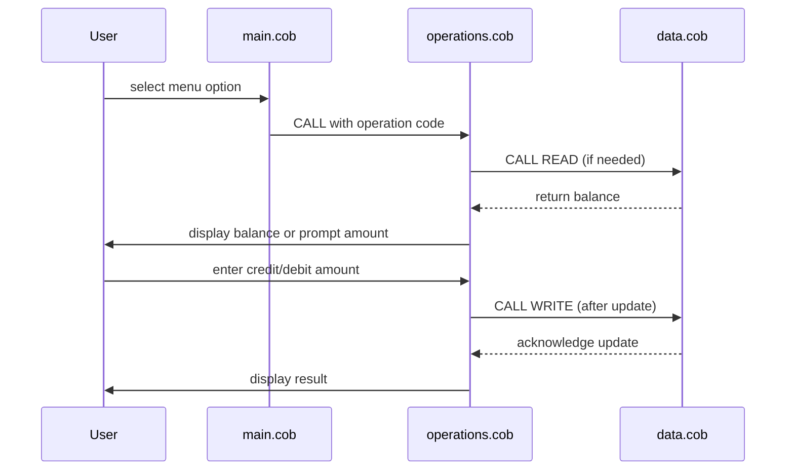

# Project Documentation

This directory contains documentation for the legacy school accounting system and any modernization efforts.

## Overview

The application consists of three COBOL programs located in `src/cobol`:

- **main.cob** – user interface and menu-driven command loop.
- **operations.cob** – handles account operations (view balance, credit, debit).
- **data.cob** – simulates storage of the account balance.

## Getting Started

To build and run the COBOL programs, use an appropriate COBOL compiler such as GNU Cobol (formerly OpenCOBOL). Example commands:

```sh
gcobc -x src/cobol/main.cob src/cobol/operations.cob src/cobol/data.cob
./main
```

## Goals

- Preserve existing business rules while modernizing code.
- Migrate data handling to a persistent storage solution.
- Add unit tests and documentation as part of the modernization.

## Branching

Work on modernization should be done in feature branches, for example `modernize-legacy-code`.

## Data Flow Sequence Diagram


